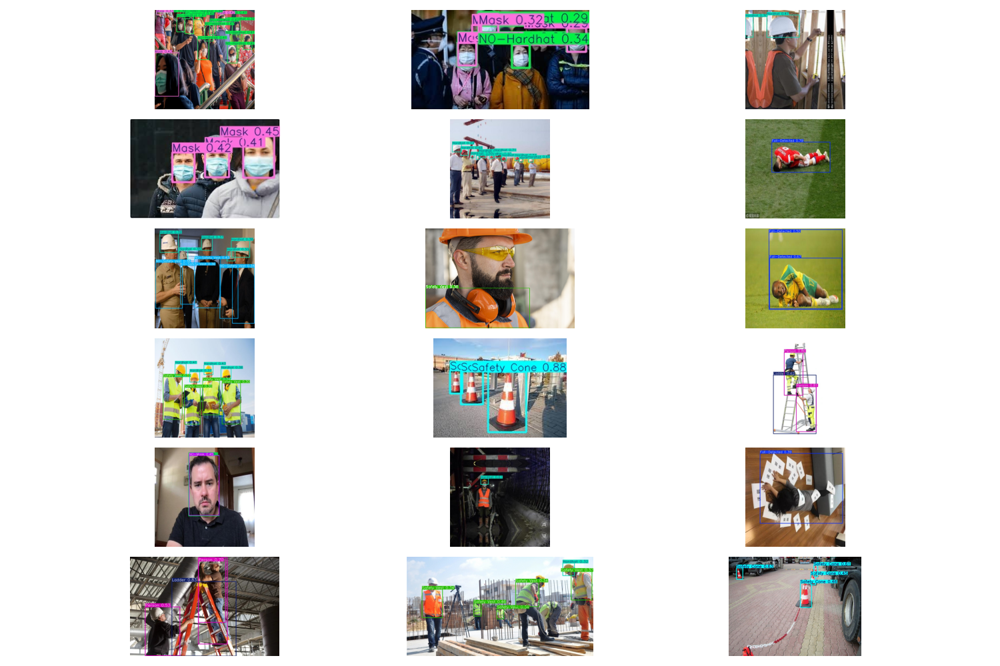

# PPE (Personal Protective Equipment) Detection with YOLOv11
---


---
## 📋 Project Overview
This project implements a Personal Protective Equipment (PPE) detection system using YOLOv11, a state-of-the-art object detection model. The system can detect various types of PPE including hard hats, safety vests, masks, and more in images and videos.

## 🎯 Features
- Detection of multiple PPE items including:
  - Hard hats
  - Safety vests
  - Masks
  - Safety glasses
  - Gloves
  - And more...
- Real-time detection on both images and videos
- High accuracy with pre-trained YOLOv11 model
- Easy-to-use prediction script
---
## 🚀 Getting Started

### Prerequisites
- Python 3.8 or higher
- CUDA-compatible GPU (recommended) or CPU
- pip (Python package manager)

### Installation

1. **Clone the repository**
   ```bash
   git clone https://github.com/mlihgenel/yolov11-ppe-detection.git
   cd yolov11-ppe-detection
   ```

2. **Create and activate a virtual environment (recommended)**
   ```bash
   python -m venv venv
   source venv/bin/activate  # On Windows: venv\Scripts\activate
   ```


## 📂 Project Structure
```
YOLOv11-PPE/
├── images/                    # Directory containing test images
│   ├── predictions/          # Directory where prediction results are saved
│   └── ...                   # Test images
├── runs/                     # Training runs and model weights
│   └── detect/               # Detection results and model checkpoints
├── video_results/            # Directory for video detection outputs
├── videos/                   # Directory containing test videos
├── ppe_yolov11_detection.ipynb  # Jupyter notebook for training
├── predict.py                # Script for running predictions
└── hyp.yaml                  # Hyperparameters configuration
```
---
## 🛠️ Usage

### Running Predictions on Images
To run detection on images in the `images/` directory:
```bash
python predict.py
```

### Running Predictions on Videos
To run detection on a video file, uncomment and modify the video prediction section in `predict.py`:

```python
# Uncomment and modify the following section in predict.py
results = model.predict(
    source="videos/your_video.mp4",  
    conf=0.25,          
    save=True,          
    project="video_results",     
    name="ppe_video_test", 
)
```

### Training the Model
If you want to retrain the model, use the provided Jupyter notebook:
1. Open `ppe_yolov11_detection.ipynb`
2. Follow the instructions in the notebook to set up your dataset and training parameters
3. Run all cells to train the model

## 📊 Model Performance
The model achieves the following performance metrics:
> **mAP@0.5:** **0.789**
> **mAP@0.5-0.95:** **0.512**
> **Precision:** **0.718**
> **Recall:** **0.84**

---

## 📂 Dataset
This project uses the Personal Protective Equipment (PPE) — Combined Model dataset hosted on Roboflow Universe.
Dataset link: [**Roboflow Universe – PPE v8**](https://universe.roboflow.com/roboflow-universe-projects/personal-protective-equipment-combined-model/dataset/8)


Details:

License: CC BY 4.0 (requires attribution)

- **Number of Classes (14):**

>Fall-Detected, Gloves, Goggles, Hardhat, Ladder, Mask, NO-Gloves, NO-Goggles, NO-Hardhat, NO-Mask, NO-Safety Vest, Person, Safety Cone, Safety Vest

Export format: YOLO (compatible with YOLOv5/8/11)

Typical directory structure:
```
datasets/PPE/
├── train/
│   ├── images/
│   └── labels/
├── valid/
│   ├── images/
│   └── labels/
├── test/
│   ├── images/
│   └── labels/
└── data.yaml
```
The data.yaml file defines dataset paths and class names.

When using this dataset in a public repository, make sure to include attribution to comply with the license.

### 🔑 Roboflow API Key

To use this dataset directly in the training notebook, you will need a Roboflow API key:

* Go to [**Roboflow**](https://universe.roboflow.com/), sign in, and open your account settings.

* Copy your Private API Key.

* Paste it into the notebook where indicated.

The notebook already contains the code to authenticate and download the dataset, so you only need to provide your key.

```python
from roboflow import Roboflow

rf = Roboflow(api_key="YOUR_API_KEY")
project = rf.workspace("roboflow-universe-projects").project("personal-protective-equipment-combined-model")
version = project.version(8)
dataset = version.download("yolov11")
```

## 📝 Notes
- The default confidence threshold is set to 0.25, which you can adjust in `predict.py`
- For best results, use well-lit images with clear visibility of PPE items
- The model works best with images where the person is clearly visible

